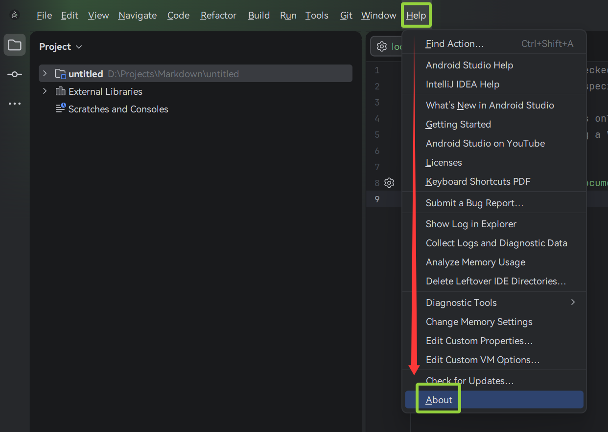
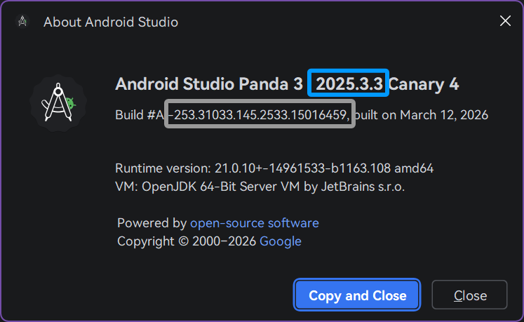
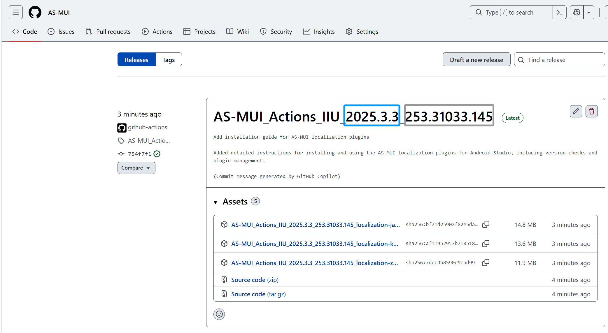
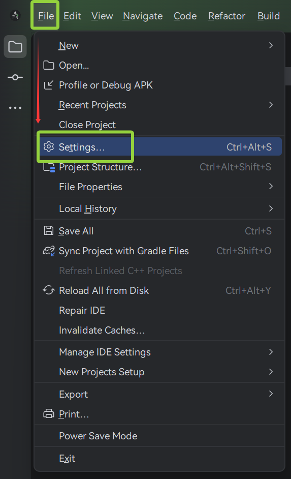
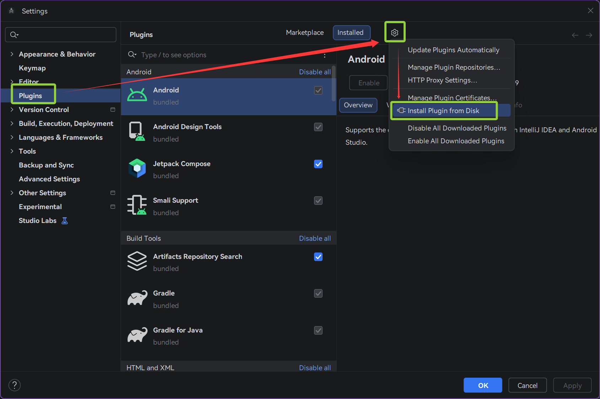
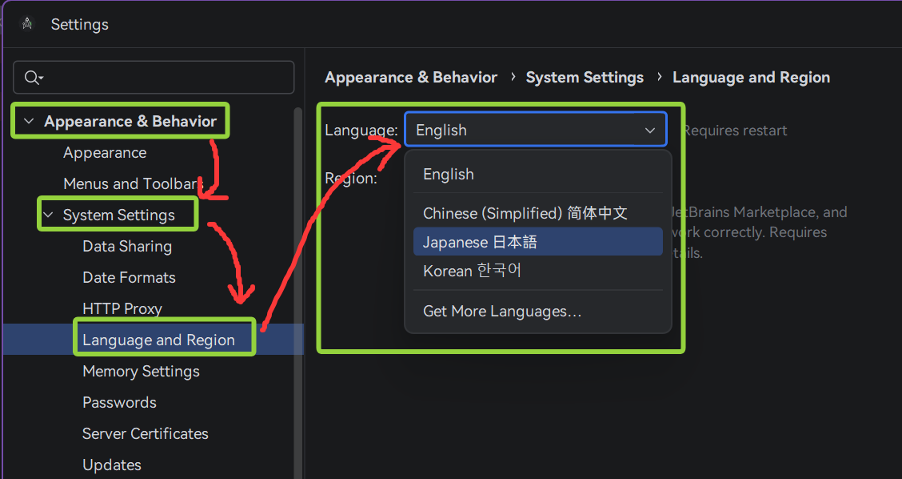
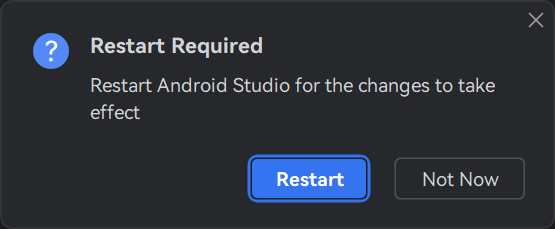
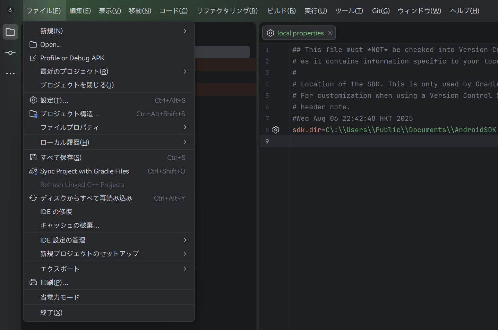
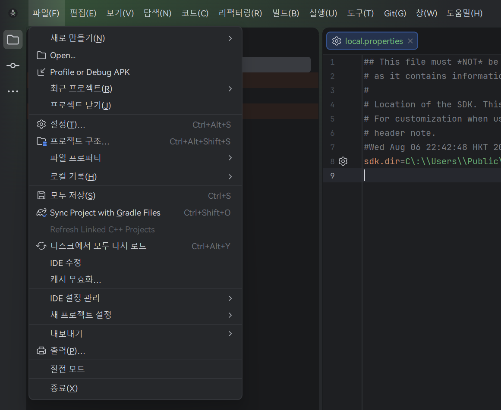
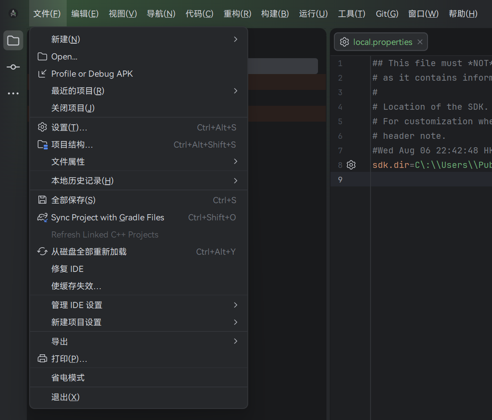

# AS-MUI (AndroidStudio localization plugins)


Android Studio UI 言語プラグインのインストール方法。

---

# 1. Android Studio のバージョン確認

| メニューバー **Help**（`Alt+H`）→ **About** をクリック | 打开菜单栏 **Help**（`Alt+H`）→ 点击 **About** | 메뉴바 **Help** (`Alt+H`) → **About** 클릭 |
| ----------------------------------------- | ------------------------------------- | ------------------------------------- |



例 / 示例 / 예시:



```text
Android Studio Panda 3 | 2025.3.3 Canary 4
Build #AI-253.31033.145.2533.15016459, built on March 12, 2026
Runtime version: 21.0.10+-14961533-b1163.108 amd64
VM: OpenJDK 64-Bit Server VM by JetBrains s.r.o.
```

確認する Build 番号 / 需要关注的 Build / 확인해야 할 Build:
```text
253.31033.145.2533.15016459
```

---

# 2. 対応する Release を選択

| Release ページからプラグインをダウンロード | 从 Release 页面下载插件 | Release 페이지에서 플러그인 다운로드 |
| ------------------------- | ---------------- | ----------------------- |

[https://github.com/HanaLuan/AS-MUI/releases](https://github.com/HanaLuan/AS-MUI/releases)

| **Android Studio Build 以下の TAG** を選択 | 选择 **小于等于 Build 的 TAG** | **Build 이하의 TAG** 선택 |
| ------------------------------------ | ----------------------- | -------------------- |

例 / 示例 / 예:



Build:

```text
253.31033.145.2533.15016459
```

選択可能 TAG:

```text
AS-MUI_Actions_IIU_2025.3.3_253.31033.145
```

注意 / 注意 / 주의:

```text
253.31033.145.2533.15016459 >= 253.31033.145
```

---

# 3. プラグインをダウンロード

| Release ページから必要な言語プラグインをダウンロード | 在 Release 页面下载语言插件 | Release 페이지에서 언어 플러그인 다운로드 |
| ------------------------------ | ------------------ | -------------------------- |

例 / 示例 / 예:

```text
localization-zh.jar
localization-ja.jar
localization-ko.jar
```

---

# 4. プラグインをインストール

| Android Studio を起動 | 打开 Android Studio | Android Studio 실행 |
| ------------------ | ----------------- | ----------------- |



```
File → Settings
```



```
Plugins
```

| 右上の歯車アイコンをクリック | 点击右上角齿轮图标 | 오른쪽 위 톱니바퀴 클릭 |
| -------------- | --------- | ------------- |

```
⚙ → Install Plugin From Disk
```

| ダウンロードした `.jar` を選択 | 选择下载好的 `.jar` | 다운로드한 `.jar` 선택 |
| - | - | - |

---

# 5. 言語を有効化

| インストール後 Android Studio を完全終了 | 安装后完全退出 Android Studio | 설치 후 Android Studio 완전히 종료 |
| ---------------------------- | ---------------------- | -------------------------- |

再起動後:



```
Settings
 → Appearance & Behavior
   → Language and Region
```

| Language で言語を選択 | 在 Language 中选择语言 | Language에서 언어 선택 |
| --------------- | ---------------- | ---------------- |



| 指示に従って再起動 | 按提示重启 | 안내에 따라 재시작 |
| --------- | ----- | ---------- |






---

<details>
<summary><b>Note: プラグインバージョンが一致しない場合</b></summary>

| プラグインが読み込めない場合は旧バージョンを試してください | 如果插件无法加载可以尝试旧版本 | 플러그인이 로드되지 않으면 이전 버전을 시도하세요 |
| ----------------------------- | --------------- | --------------------------- |

最近 **3つの旧 Release** を試すことを推奨します。

降級前の手順:

1. Android Studio を完全終了
2. 既存のプラグインを削除

Windows:

```
%USERPROFILE%\AppData\Roaming\Google\AndroidStudio2025.3.3\plugins
```

削除:

```
localization-ko.jar
localization-ja.jar
localization-zh.jar
```

その後 Android Studio を起動して再インストールしてください。

</details>
<!-- <br /> -->
<details>
<summary><b>Note: プラグインの読み込み時に「contains invalid plugin descriptor」というエラーが表示される</b></summary>

以下の Release TAG またはそれ以前:

```
AS-MUI_Actions_IIU_2025.3.2_253.30387.90
```

Android Studio で次のエラーが表示される可能性があります:

```
File 'localization-ja.jar' contains invalid plugin descriptor
```

この問題は次の commit で修正を試みています:

[https://github.com/HanaLuan/AS-MUI/commit/d8cc2467b23245ff9f78635e94615a4856243b42](https://github.com/HanaLuan/AS-MUI/commit/d8cc2467b23245ff9f78635e94615a4856243b42)

問題がある場合:

* Issue を作成
* Pull Request を歓迎します

</details>
